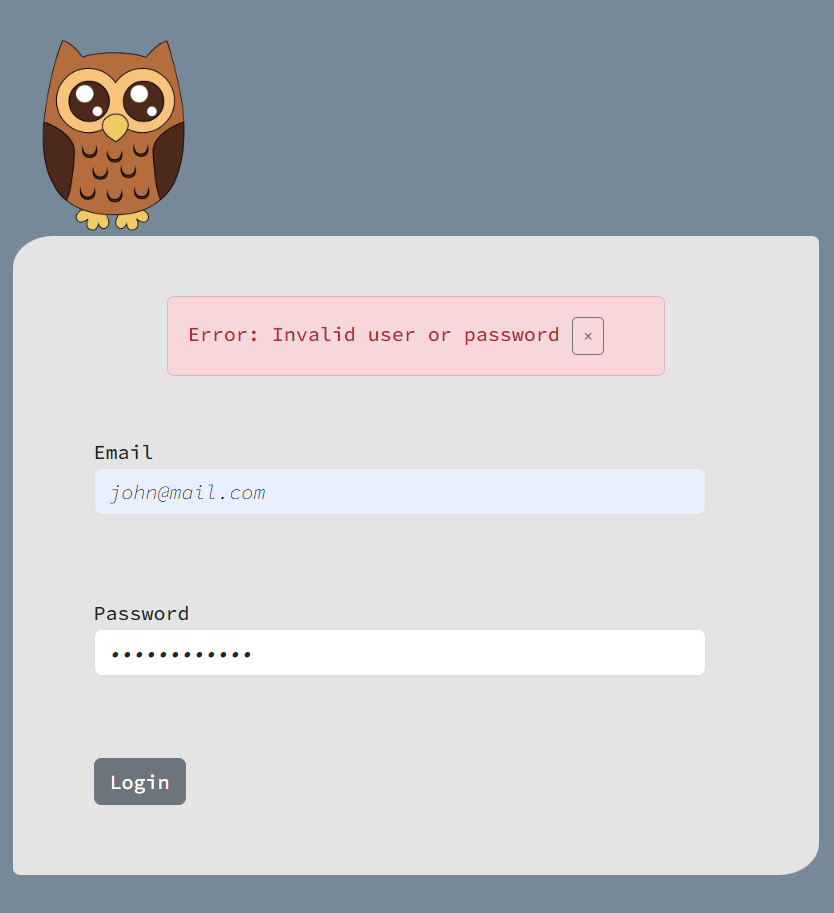
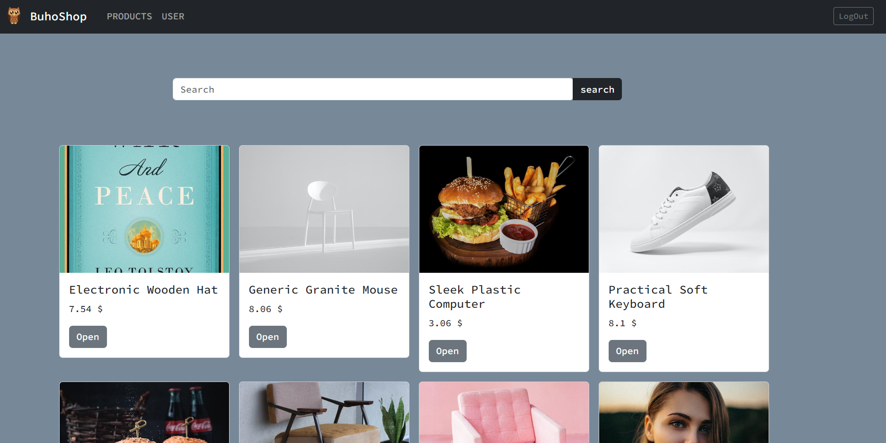
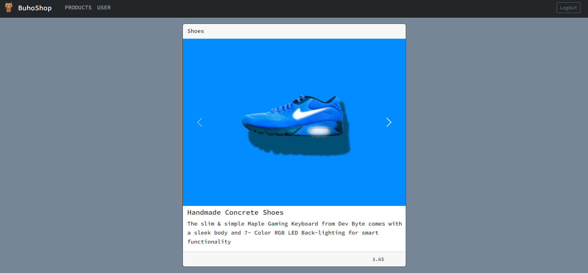
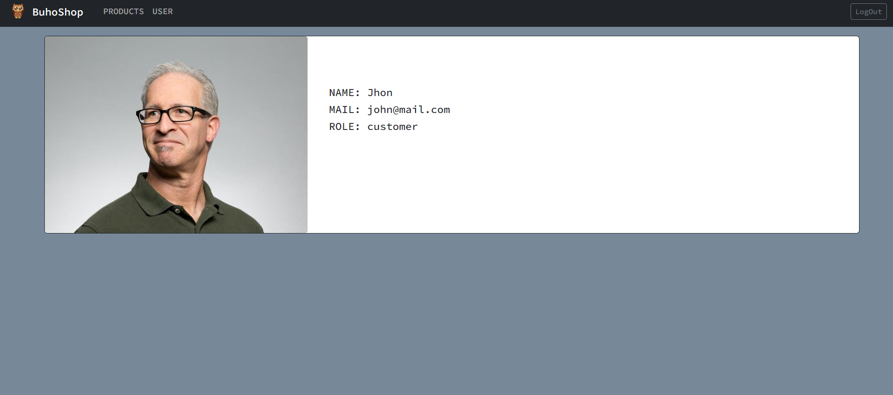

# BuhoShop

## What is BuhoShop?

It's frontend aplication where you can login and check multiple products. The backend works throug the <a href="https://fakeapi.platzi.com">Platzi API</a>.

### Login



### Check products



### Check each product info



### Check user info



#### How to login?

To login there isn't a create user option right now, so you can use a predeterminate user with the email <i>john@mail.com</i> and the password <i>changeme</i>.


## Project setup
```
npm install
```

### Compiles and hot-reloads for development
```
npm run serve
```

### Compiles and minifies for production
```
npm run build
```

### Lints and fixes files
```
npm run lint
```

### Customize configuration
See [Configuration Reference](https://cli.vuejs.org/config/).
